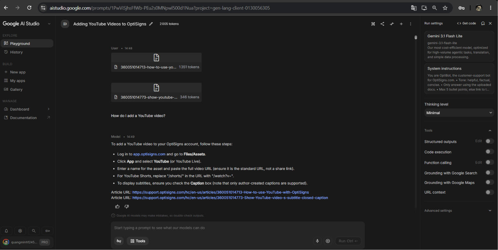

# OptiBot

## Setup

```bash
python -m venv .venv
.venv\Scripts\activate
pip install -r requirements.txt
copy .env.sample .env
```

Add `GEMINI_API_KEY` to `.env`. Do not commit `.env`.

## Run Locally

Scrape support articles:

```bash
python scraper.py
```

Upload Markdown files to Gemini File API knowledge context and run the sample question:

```bash
python upload_to_gemini.py
```

The script writes `upload_manifest.json` and `gemini_test_answer.txt`, including file count and estimated embedded chunk count.

Run the daily delta job locally:

```bash
python main.py
```

Run the daily delta job with Docker:

```bash
docker build -t optibot-mini .
docker run --rm -e API_KEY=your-gemini-api-key optibot-mini
```

The daily job scrapes from scratch, compares `manifest.json` hashes, uploads only added/updated Markdown files, and writes `job_logs/latest.json`.
For a real daily cloud job, persist `manifest.json` and `upload_manifest.json` between runs. If `upload_manifest.json` is missing, `main.py` bootstraps by uploading all Markdown files once.

## Chunking

Gemini uses document-level chunking: each Markdown article is one uploaded knowledge file. For the sample question, the script retrieves YouTube-related uploaded docs by filename and passes those uploaded docs as model context.

## Daily Job Log

* **Public Hosted Log URL**: [GitHub Actions Daily Workflow Run #29001145228](https://github.com/qthinhbk/optibot-mini/actions/runs/29001145228)
* **Latest Run Artifact (latest-job-log)**: [Download latest.json](https://github.com/qthinhbk/optibot-mini/actions/runs/29001145228/artifacts/8191787223)
* **Local Artifact**: `job_logs/latest.json`

### GitHub Actions Deployment

1. Add repository secret `GEMINI_API_KEY`.
2. Push this repo.
3. Run **Daily OptiBot Knowledge Refresh** manually once, or wait for the daily cron.
4. Use that workflow run's `latest-job-log` artifact as the public/latest run log.

Latest job run output:
```json
{
  "added": 0,
  "updated": 0,
  "skipped": 406,
  "uploaded": 0
}
```

## Screenshot


